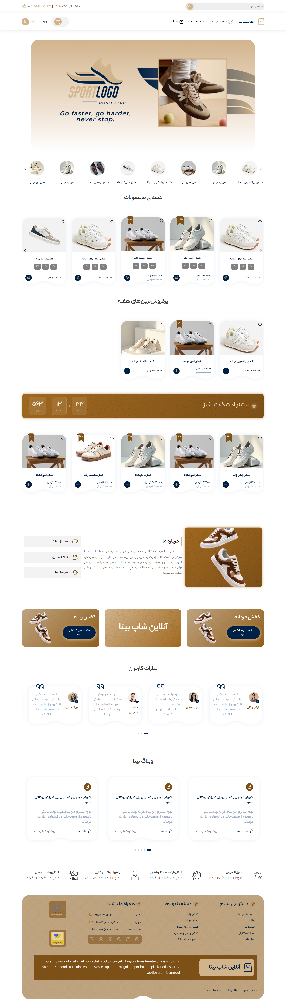
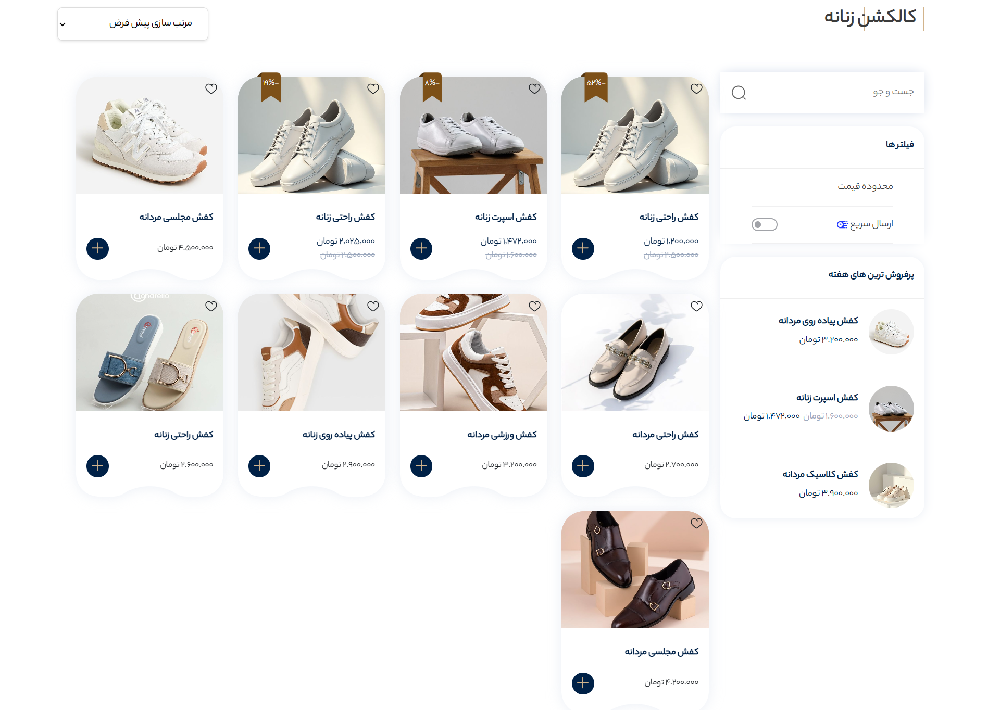
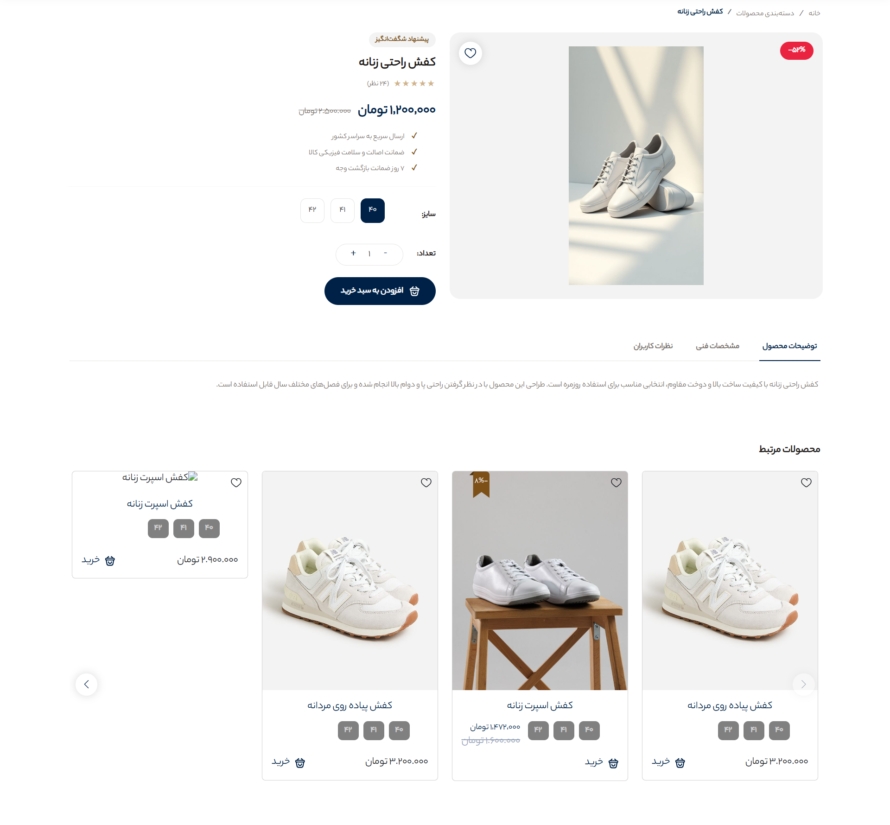
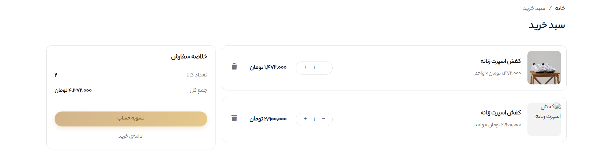

# 👟 Bita Theme — Online Shoe Store

A responsive Persian shoe e-commerce website built with HTML, CSS, Vanilla JavaScript, and Bootstrap.

---

## Overview

Bita Theme is a frontend e-commerce project for an online shoe store, built without a JavaScript framework or build tool.

The project focuses on creating a responsive Persian RTL shopping experience with product browsing, product details, shopping cart functionality, and data-driven content.

Product, review, and article data are loaded from JSON files, while cart data is persisted using `localStorage`.

---

## Features

### Storefront

- Responsive home page
- Best-selling products
- Special offers
- Women's collection
- Customer reviews
- Blog articles
- Product category page
- Best-sellers sidebar

### Product Details

- Product image gallery
- Size selection
- Quantity selector
- Add to cart
- Product description
- Product specifications
- Product reviews
- Related products

### Shopping Cart

- Add products from product cards
- Add products from product details
- Update product quantities
- Remove products
- Persistent cart using `localStorage`
- Demo checkout flow

### Persian RTL Experience

- Fully RTL interface
- Persian UI content
- YekanBakh font
- Automatic conversion of English numbers to Persian numerals
- Responsive layout for different screen sizes

---

## Tech Stack

| Technology | Purpose |
|---|---|
| HTML5 | Page structure |
| CSS3 | Custom styling and responsive design |
| Vanilla JavaScript | Application logic and interactions |
| Bootstrap 5 RTL | Responsive layout and UI utilities |
| Swiper.js | Product and content sliders |
| JSON | Product, review, and article data |
| localStorage | Shopping cart persistence |

---

## Project Structure

```text
Bita_Theme/
├── index.html
│
├── JavaScript/
│   └── Global scripts and utilities
│
├── Styles/
│   └── Global styles
│
├── json/
│   └── Product, review, and article data
│
├── package/
│   └── Bootstrap and Swiper libraries
│
├── assets/
│   ├── fonts/
│   └── images/
│
├── pages/
│   ├── product-category/
│   ├── product-details/
│   └── cart/
│
└── docs/
    └── screenshots/
````

---

## Key Implementation Details

### Data-driven Content

Product, review, and article information is separated from the HTML and stored in JSON files.

This allows the content to be updated without manually changing the page structure.

### Shopping Cart Persistence

The shopping cart uses the browser's `localStorage` API to persist products and quantities between page refreshes.

Users can:

* Add products
* Update quantities
* Remove products
* Continue shopping without losing their cart

### RTL Support

The entire interface is designed for Persian users and follows a right-to-left layout.

Bootstrap's RTL version is used together with custom CSS to maintain consistent spacing, typography, and component behavior.

### Responsive Design

The website is designed to adapt to desktop, tablet, and mobile screen sizes.

Mobile-specific screenshots are available in:

```text
docs/screenshots/
```

---

## Design

The interface is designed as a modern Persian fashion e-commerce website.

Key design characteristics include:

* Persian RTL layout
* Clean product-focused interface
* Responsive product grids
* Custom YekanBakh typography
* Product galleries and sliders
* Bootstrap-based responsive layout
* Consistent spacing and visual hierarchy

---

## Screenshots

### Home Page



### Product Category



### Product Details



### Shopping Cart



> Screenshot filenames should match the actual files inside `docs/screenshots/`.

---

## Getting Started

### Prerequisites

No Node.js setup or build process is required.

You only need:

* A modern web browser
* A local web server

### Run with `serve`

Because the project uses absolute paths such as `/Styles/...` and `/json/...`, it should be served through a local web server instead of being opened directly from the file system.

Run:

```bash
npx serve .
```

Then open the local address provided by the server.

### Run with VS Code

You can also use the **Live Server** extension in Visual Studio Code.

Open the project folder and launch `index.html` using Live Server.

---

## Project Goals

This project was built to practice and demonstrate:

* Semantic HTML
* Responsive CSS
* Vanilla JavaScript
* Bootstrap RTL
* DOM manipulation
* Browser localStorage
* JSON-based data handling
* Responsive e-commerce UI development
* Persian RTL interface development

---

## Author

**Yekta Akhavan**

Frontend Developer focused on building responsive and maintainable web applications with React, JavaScript, TypeScript, and modern frontend tools.

* [GitHub](https://github.com/yektaakhavan)
* [LinkedIn](https://www.linkedin.com/in/yekta-akhavan/)
* [Portfolio](https://yekta-akhavan.vercel.app/)
* [Instagram](https://www.instagram.com/yektaakhavan.dev/)
* [Email](mailto:yekta.akhavan.dev@gmail.com)